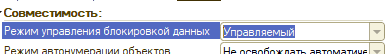
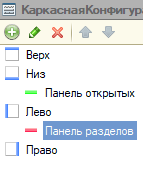

# Базовые настройки каркасной конфигурации

**Дисклеймер** Данные записи, по-сути, практическая выжимка решения, теор. часть практически не разбирается! Поэтому важен теоретических базис от любого доступного источника: Курс 1С УЦ, Курс Гилёва, Курс Чистова, практическое пособие разработчика и т.д.

## Общая информация

Базовая конфигурация - конфигурация, подготовленная специально для сдачи экзамена специалист по платформе.

**ВАЖНО!**

1. Она содержит базовые объекты и уже введённые данные, а также некоторые **ошибки** которые нужно исправить, чтобы успешно сдать экзамен!
2. Перед экзаменом нужно внимательно изучить состав каркасной конфигурации и знать его практически наизусть, так как если для решения задачи нужны какие-то метаданные, сначала старайтесь использовать каркасные, а уж потом создать свои.
3. Объекты базовой конфигурации удалять запрещено. Реквизиты объектов менять, добавлять и удалять можно и нужно, если того требует или НЕ требует решение
4. Отдельно обращу внимание, что в конфигурации есть две обработки:
    * *Консоль запросов* - пригождается иногда, если не идёт отчет или хочется по быстрому проверить получаемый результат
    * *Заполнение графика* - нужна для решения задач по ЗУП

## Настройка свойств каркасной конфигурации
  
### Обязательные настройки
  
* Настроить свойства конфигурации (ПКМ по корню конфигурации - "Свойства")  
  * Свойство "Режим управления блокировкой данных" = "Управляемый"  
    * За невыставленное свойство сразу несдача

    

### Не обязательные, но полезные
  
* Включить возможность запуска обработки "Консоль запросов", для этого проделать следующее:
  * Включить поддержку обычного приложения "Сервис" - "Параметры" - "Общие" - "Управляемое приложение и обычное приложение"
  * В свойствах корня конфигурации:
    * Поставить флаг "Использовать обычные формы в управляемом приложении"
    * Если не собираетесь редактировать код обработки (см. ниже), то выставить свойство "Режим использования модальности" - "Использовать с предупреждением"
  * Для того, чтобы консоль запускалась необходимо 1С:Предприятие запускать в режиме "Толстый клиент (управляемое приложение)". Сделать это можно двумя путями:
    * Включить этот режим запуска "по-умолчанию": Сервис - Параметры - Запуск 1С Предприятия - Основные - Толстый клиент (управляемое приложение)
    * Вывести на форму кнопку запуска отладки "Толстый клиент (управляемое приложение)" (в интерфейсе, там где кнопка запуска отладки нажать стрелку вниз - добавить или удалить кнопки)
  * Отредактировать код обработки:
    * Вместо "Предупреждение" использовать "ПоказатьПредупреждение"
      * модуль формы "Форма" - стр. 218, 452, 470
      * модуль формы "ФормаПараметров" - стр. 67, 75
    * Вместо "ОткрытьЗначение" - "ПоказатьЗначение"
      * Модуль формы "Форма" - стр. 682

## Предварительная настройка объектов метаданных

* Настроить вид клиентского приложения согласно билету, н-р:
  * ПКМ по корню конфигурации - настроить интерфейс клиентского приложения

    * Верх - *Пусто*
    * Низ - "Панель открытых"
    * Лево - "Панель разделов"
    * Право - *Пусто*

    

* Создать подсистемы

  * **Полезный прием!** Перетащить раздел "Общие картинки" на "Подсистемы"
    * Удалить подсистему "Сервис"
    * Если задача по "Упр. формам" - переименовать подсистему "Бизнес-процессы" в "Управляемые формы"
    * Привязать к подсистеме соответствующую общую картинку
      * Подсистема "Оперативный учет" = общая картинка "Оперативный учет"...
      * К подсистеме "Управляемые формы" картинку привязывать не надо

  * Выстроить подсистемы в порядке, указанном в билете
    * ПКМ по корню конфигурации - Настроить командный интерфейс клиентского приложения
    * Базовый порядок:
      * Оперативный учет
      * Бухгалтерский учет
      * Расчеты
      * Бизнес-процессы / Управляемые формы
    * Других подсистем быть не должно, только если об это не сказано в задании
* Создать общие группы команд, как показано в билете. Обычно это:
  * Документы
  * Справочники
  * Планы видов характеристик
  * Планы счетов
  * Планы видов расчета
  * Регистры сведений
  * Регистры накопления
  * Регистры бухгалтерии
  * Регистры расчета
  * *опционально* Бизнес-процессы
  * *опционально* Задачи
* Если есть задача по бизнес-процессам, то
  * Создать роль "ПолныеПрава"
    * Данной роли дать права на ВСЕ объекты конфигурации и включить наследование
  * Создать пользователя с именем "Администратор"
    * "Администрирование" - "Пользователи" - "Создать..."
  * Назначить ему роль "ПолныеПрава" на вкладке "Права"
  * Перезайти в конфигуратор под пользователем "Администратор"
    * Все манипуляции делать под этим пользователем
