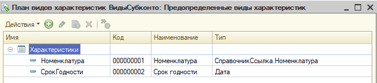
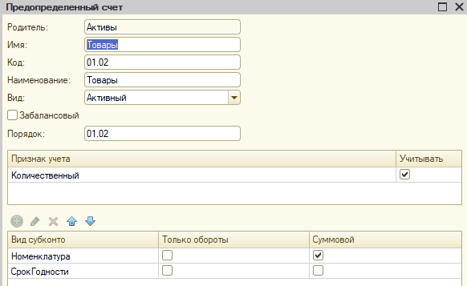
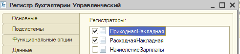
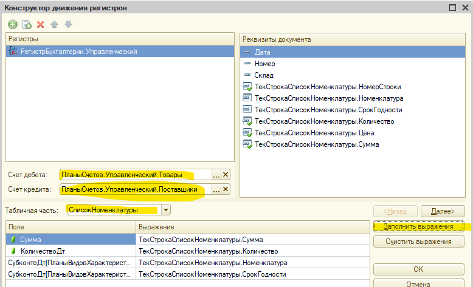

# Билет 1 - решение задачи по бух. учёту

**Дисклеймер** Данные записи, по-сути, практическая выжимка решения, теор. часть практически не разбирается! Поэтому важен теоретических базис от любого доступного источника: Курс 1С УЦ, Курс Гилёва, Курс Чистова, практическое пособие разработчика и т.д.

## Краткая справка

---

1. При построении решения обязательно использовать следующие метаданные (за не использование сразу неуд.):
    * План видов характеристик *Виды субконто*
      * Необходим для заведения выявленных в ходе решения аналитик, кроме тех, которые будут измерениями (см. раздел **Анализ билета**)
    * План счетов *Управленческий*
      * Необходим для заведения регистра бухгалтерии к которому привязывается ПВХ *Виды субконто* (подробнее см. теорию)
    * Регистр бухгалтерии
      * строится на основании выявленных аналитик с привязкой и к плану счетов и к видам субконто (подробнее в примере решения)
2. *ВАЖНО!* НЕЛЬЗЯ добавлять и удалять счета учета из плана счетов, только если на это нет указания в задании!
3. Все добавляемые элементы должны быть предопределёнными, чаще всего это касается новых видов субконто
4. Все объекты решения всегда должны быть включены в соответствующую подсистему и разнесены по группам (см. базовые настройки конфигурации...)
    * делается это перед началом тестирования решения
5. Два слова о плане счетов
    * *Признак учёта* - позволяет **включить** учёт по ресурсу для счетов. По умолчанию: **выключен (ЛОЖЬ)**
    * *Признак учёта субконто* - позволяет **выключить** учёт по ресурсу для субконто. По умолчанию: **Включен (Истина)**
    * У субконто есть признак *Только обороты* - это аналог вида регистра накопления: *Выключен* - это остатки, *Включен* - обороты. Это важно для будущих задач

## Анализ билета

---

Выделяем ключевые особенности решения 1-2 словами, чтобы потом по этому чек-листу разрабатывать решение

* Используемые документы: "Приходная накладная", "Расходная накладная"
* Создать документ "Операция"
* Учет в разрезе сроков годности (Дата) / указывается в ТЧ
* Списание при продаже - от мин. срока
* Себестоимость - средняя по товару в целом
* Отчет по кол-ву и сумме в разрезе товаров и сроков годности
  * Сумма расчетная! = [СредняяЦена] * [КоличествоПоСроку]
    * СредняяЦена = [СебестоимостьПоТовару] / [КоличествоТовара]

Полезно выписать проводки на листок, чтобы потом не смотреть в билет:

* Приходная накладная
  * *ДТ "Товары" = КТ "Поставщики" на кол-во и сумму закупа*
  
* Расходная накладная
  * *ДТ "Прибыли и убытки" = КТ "Товары" на кол-во и сумму себестоимости*
  * *ДТ "Покупатели" = КТ "Прибыли и убытки" на кол-во и сумму продажи*

**Проектирование регистра начинается с анализа отчета!**

* В отчете есть аналитики: *Товар* и *Срок годности*: значит  будет минимум 2 субконто: *Номенклатура*, *Срок годности*
  * В других билетах одна из аналитик может быть измерением. Чаще всего: *Организация*

* В отчете есть данные по количеству, а значит должен быть ресурс *Количество*. Настройки этого ресурса одинаковы для всех задач:
  * Заводится признак ведения учета *Количественный*
  * Признак подключается к нужному счету (в нашем случае это счет *Товары*)
  * У ресурса регистра отключить признак *балансовый*

* Как достать количество?
  * Из таблицы остатков *Регистра Бухгалтерии*. Отборы и поля:
    * Счет: *Товары*
    * Субконто: *Номенклатура*, *СрокГодности*
    * берём реквизит *КоличествоОСтаток*

* как достать данные для расчета суммы?
  * Из таблицы остатков *Регистра Бухгалтерии*. Отборы и поля:
    * Счет: *Товары*
    * Субконто: *Товары*
    * Формула: *СуммаОстаток* / *КоличествоОстаток* с проверкой на 0
* Итого: 2 запроса и соединение между ними (в нашем случае *внутреннее* ибо один и тот же счет за один и тот же период)

**ВАЖНО! Актуально для всех задач всех учётов** Подобный анализ требуется делать ВСЕГДА ДО решения билета, а то потом возможны ситуации, когда отчет не собирается!

Дальше анализируем другие условия: есть ли там доп. аналитики или специфические условия, кроме выявленных в отчете? В нашем случае нет, поэтому можно приступать к решению билета

### Подготовка объектов метаданных

---

* В данной задаче НИЧЕГО не сказано про услуги, но про услуги сказано в задаче по ОУ, поэтому и тут нужно фильтровать услуги.

* В табличную часть документов *Приходная накладная* и *Расходная накладная* добавляем новый реквизит *Срок годности*
  * Тип: *Дата* - *Дата*
  * Ставим признак *Проверка заполнения* в *Выдавать ошибку*
  * требуется для *Учет в разрезе сроков годности (Дата) / указывается в ТЧ*

* Настраиваем план видов субконто *Виды субконто*
  * Субконто *Номенклатура* уже есть в каркасной конфигурации
  * Добавляем необходимые типы в настройки ПВХ
    * в нашем случае тип *Дата*-*Дата*
  * Добавляем новый вид субконто в предопределённые - *Срок годности* (*Дата*-*Дата*)
  * Требуется для **всех** ключевых особенностей билета

    

* Настраиваем план счетов *"Управленческий"*
  
  * Вкладка *"Данные"*

    * Добавляем признак учёта *Количественный* - настраиваем признаки учёта по счетам
      * Товары должны списываться по количеству, значит нужен будет ресурс *Количество*
      * Ресурс количество в разрезе задачи важен только для 1 счёт *Товары*, значит нужен признак, позволяющий **включить** учёта по количеству для этого счёта
  
    

  * Вкладка *"Субконто"*

    * Привязываем ПВХ *"Виды субконто"* - настраиваем субконто

    * Выставляем макс. количество субконто
      * в процессе анализа выявлено 2 аналитики
      * Отчет строится только через счёт *Товары* и обе аналитики участвуют в отчете, значит на нём должно быть 2 субконто
      * Других аналитик нет, значит макс. количество субконто = 2

    * Добавляем признак учёта субконто *"Суммовой"*
      * Себестоимость считает по товару в целом, значит показатель суммы для субконто "Срок годности" для нас неважен
      * В отчете сумма - это расчетный показатель, значит для вывода нам сумма не нужна
      * Вывод: на субконто "Срок годности" нет нужны вести суммовой учёт, поэтому требуется признак **отключения** учёта по сумме
  
    

  * Вкладка *"Прочее"* - *"Предопределенные"* - настраиваем счета
    * Дополнительные настройки нужны ТОЛЬКО для счета товары, поэтому настраиваем только его
    * Включаем признак учета *Количественный*
    * Добавляем 2 субконто: *Товары* и *Срок годности*

    

  * Требуется для **всех** ключевых особенностей билета
  
  * Создаём регистр бухгалтерии *"Управленческий**
  
    * Вкладка *"Основные"*
      * Привязываем регистру план счетов *Управленческий*
      * Включаем флаг *Корреспонденция* - этот флаг на экзамен включается всегда

      

    * вкладка *"Данные"*
      * Измерений нет
      * Ресурсы
        * *Сумма* (тип: *число(12,2)*)- будет всегда в любой задаче
          * Выставляем *Признак учёта субконто* - *Суммовой*
          * флаг "Балансовый" *должен быть включен*
        * *Количество* (тип: *число(10,0)*)
          * Выставляем *Признак учёта* - *Количественный*
          * флаг "Балансовый" *должен быть выключен*

        

        

    * Вкладка *"Регистраторы"*
      * Добавляем наши документы

    

  * Создаём документ *"Операция"*
    * Вкладка *"Движения"*
      * Признак *Проведение* - *Запретить*
      * Выбрать наш регистр *Управленческий*

      

    * Создаем форму документа
      * Выводим *Объект* - *Движения* - *Управленческий* - на форму документа

      

    * Требуется для *Создать документ "Операция"*

### Настройка документа "Приходная накладная"

* Для ускорения процесса первичные движения всегда накидываем через конструктор движений
  * Проводку записали ранее:*ДТ "Товары" - КТ "Поставщики" на кол-во и сумму закупа*



* Результат:

```1C
    // регистр Управленческий 
    Движения.Управленческий.Записывать = Истина;
    Для Каждого ТекСтрокаСписокНоменклатуры Из СписокНоменклатуры Цикл
        Движение = Движения.Управленческий.Добавить();
        Движение.СчетДт = ПланыСчетов.Управленческий.Товары;
        Движение.СчетКт = ПланыСчетов.Управленческий.Поставщики;
        Движение.Период = Дата;
        Движение.Сумма = ТекСтрокаСписокНоменклатуры.Сумма;
        Движение.КоличествоДт = ТекСтрокаСписокНоменклатуры.Количество;
        Движение.СубконтоДт[ПланыВидовХарактеристик.ВидыСубконто.Номенклатура] = ТекСтрокаСписокНоменклатуры.Номенклатура;
        Движение.СубконтоДт[ПланыВидовХарактеристик.ВидыСубконто.СрокГодности] = ТекСтрокаСписокНоменклатуры.СрокГодности;
    КонецЦикла;
```

* Для оптимальности решения дорабатываем старый алгоритм, чтобы он вносил новые данные
  * На экзамене желательно сразу писать с учётом этих изменений, чтобы потом не переделывать

```1C  
    Движения.ОстаткиНоменклатуры.Записывать = Истина;
    Движения.ПартииНоменклатуры.Записывать = Истина;
    Движения.Управленческий.Записывать = Истина;
    
    Запрос = Новый Запрос;
    Запрос.Текст = 
        "ВЫБРАТЬ
        |    ПриходнаяНакладнаяСписокНоменклатуры.Ссылка.Дата КАК Дата,
        |    ПриходнаяНакладнаяСписокНоменклатуры.Ссылка.Склад КАК Склад,
        |    ПриходнаяНакладнаяСписокНоменклатуры.Номенклатура КАК Номенклатура,
        |    ПриходнаяНакладнаяСписокНоменклатуры.Количество КАК Количество,
        |    ПриходнаяНакладнаяСписокНоменклатуры.Сумма КАК Сумма,
        |    ПриходнаяНакладнаяСписокНоменклатуры.СрокГодности КАК СрокГодности
        |ИЗ
        |    Документ.ПриходнаяНакладная.СписокНоменклатуры КАК ПриходнаяНакладнаяСписокНоменклатуры
        |ГДЕ
        |    ПриходнаяНакладнаяСписокНоменклатуры.Ссылка = &Ссылка
        |    И ПриходнаяНакладнаяСписокНоменклатуры.Номенклатура.ВидНоменклатуры = ЗНАЧЕНИЕ(Перечисление.ВидыНоменклатуры.Товар)
        |ИТОГИ
        |    МАКСИМУМ(Дата),
        |    МАКСИМУМ(Склад),
        |    СУММА(Количество),
        |    СУММА(Сумма)
        |ПО
        |    Номенклатура";
    
    Запрос.УстановитьПараметр("Ссылка", Ссылка);
    
    РезультатЗапроса = Запрос.Выполнить();
    
    ВыборкаНоменклатура = РезультатЗапроса.Выбрать(ОбходРезультатаЗапроса.ПоГруппировкам);
    
    Пока ВыборкаНоменклатура.Следующий() Цикл

        Движение = Движения.ОстаткиНоменклатуры.Добавить();
        Движение.ВидДвижения = ВидДвиженияНакопления.Приход;
        Движение.Период = Дата;
        Движение.Номенклатура = ВыборкаНоменклатура.Номенклатура;
        Движение.Склад = Склад;
        Движение.Количество = ВыборкаНоменклатура.Количество;
        
        Движение = Движения.ПартииНоменклатуры.Добавить();
        Движение.ВидДвижения = ВидДвиженияНакопления.Приход;
        Движение.Период = Дата;
        Движение.Номенклатура = ВыборкаНоменклатура.Номенклатура;
        Движение.Партия = Ссылка;
        Движение.Количество = ВыборкаНоменклатура.Количество;
        Движение.Сумма = ВыборкаНоменклатура.Сумма;
    
        ВыборкаДетальныеЗаписи = ВыборкаНоменклатура.Выбрать();
    
        Пока ВыборкаДетальныеЗаписи.Следующий() Цикл
            
            Движение = Движения.Управленческий.Добавить();
            Движение.СчетДт = ПланыСчетов.Управленческий.Товары;
            Движение.СчетКт = ПланыСчетов.Управленческий.Поставщики;
            Движение.Период = Дата;
            Движение.Сумма = ВыборкаДетальныеЗаписи.Сумма;
            Движение.КоличествоДт = ВыборкаДетальныеЗаписи.Количество;
            Движение.СубконтоДт[ПланыВидовХарактеристик.ВидыСубконто.Номенклатура] = ВыборкаДетальныеЗаписи.Номенклатура;
            Движение.СубконтоДт[ПланыВидовХарактеристик.ВидыСубконто.СрокГодности] = ВыборкаДетальныеЗаписи.СрокГодности;
            
        КонецЦикла;
        
    КонецЦикла;
```

### Настройка документа "Расходная накладная"

* Методика проведения по регистру бухгалтерии практически всегда старая, в силу специфики этого регистра

* При установке блокировки важно помнить:
  * всегда надо блокировать счёт, к которому мы делаем запрос (иначе ошибка *избыточная блокировка*)
  * при блокировке по субконто всегда указывать предопределённый элемент ПВХ в качестве 1го параметра, а не строку)

* Чтобы гарантировать правильные отборы при любом порядке субконто у виртуально таблицы есть специальный параметр - "Субконто" - в него надо всегда передавать массив субконто в том порядке, в котором вы их используете в запросе
  * н-р: в разрабатываемом алгоритме, предполагается, что "Субконто1" - это номенклатура
    * на него накладывает отбор, как на отбор по номенклатуре и делаются соединения
    * значит, надо в массив субконто передать массив, где субконто "Номенклатура" будет на первом месте (смотрите код)

* В запросе не забываем использовать виртуальную таблицу, которую создали и запомнили ранее

* Разрабатываемый код для бух. учёта

```1C  
    Движения.Управленческий.Записывать = Истина;
    Движения.Управленческий.Записать();

    Блокировка = Новый БлокировкаДанных;
    ЭлементБлокировки = Блокировка.Добавить("РегистрБухгалтерии.Управленческий");
    ЭлементБлокировки.УстановитьЗначение("Счет", ПланыСчетов.Управленческий.Товары);
    ЭлементБлокировки.Режим = РежимБлокировкиДанных.Исключительный;
    ЭлементБлокировки.ИсточникДанных = СписокНоменклатуры;
    ЭлементБлокировки.ИспользоватьИзИсточникаДанных(ПланыВидовХарактеристик.ВидыСубконто.Номенклатура, "Номенклатура");
    Блокировка.Заблокировать();    
    
    Запрос.Текст = 
    "ВЫБРАТЬ
    |    ВТ_ДанныеДок.Номенклатура КАК Номенклатура,
    |    ВТ_ДанныеДок.Номенклатура КАК НоменклатураПредставление,
    |    ВТ_ДанныеДок.Количество КАК Количество,
    |    ЕСТЬNULL(УправленческийОстатки.КоличествоОстаток, 0) КАК КоличествоСрок,
    |    ЕСТЬNULL(УправленческийОстатки.СуммаОстаток, 0) КАК СуммаСрок,
    |    УправленческийОстатки.Субконто2 КАК СрокГодности,
    |    ВТ_ДанныеДок.Сумма КАК Сумма
    |ИЗ
    |    ВТ_ДанныеДок КАК ВТ_ДанныеДок
    |        ЛЕВОЕ СОЕДИНЕНИЕ РегистрБухгалтерии.Управленческий.Остатки(
    |                &МоментВремени,
    |                Счет = ЗНАЧЕНИЕ(ПланСчетов.Управленческий.Товары),
    |                &МасСубконто,
    |                Субконто1 В
    |                    (ВЫБРАТЬ
    |                        ВТ_ДанныеДок.Номенклатура КАК Номенклатура
    |                    ИЗ
    |                        ВТ_ДанныеДок КАК ВТ_ДанныеДок)) КАК УправленческийОстатки
    |        ПО ВТ_ДанныеДок.Номенклатура = УправленческийОстатки.Субконто1
    |
    |УПОРЯДОЧИТЬ ПО
    |    СрокГодности
    |ИТОГИ
    |    МАКСИМУМ(Количество),
    |    СУММА(КоличествоСрок),
    |    СУММА(СуммаСрок),
    |    МАКСИМУМ(Сумма)
    |ПО
    |    Номенклатура";

    МасСубконто = Новый Массив;
    МасСубконто.Добавить(ПланыВидовХарактеристик.ВидыСубконто.Номенклатура);
    МасСубконто.Добавить(ПланыВидовХарактеристик.ВидыСубконто.СрокГодности);
    Запрос.УстановитьПараметр("МасСубконто", МасСубконто);
    Запрос.УстановитьПараметр("МоментВремени", МоментВремени());
    Запрос.УстановитьПараметр("Ссылка", Ссылка);
    
    РезультатЗапроса = Запрос.Выполнить();
    
    ВыборкаНоменклатура = РезультатЗапроса.Выбрать(ОбходРезультатаЗапроса.ПоГруппировкам);
    
    Сумма = 0;
    
    Пока ВыборкаНоменклатура.Следующий() Цикл
        
        НеХватает = ВыборкаНоменклатура.Количество - ВыборкаНоменклатура.КоличествоСрок;
        Если НеХватает > 0 Тогда
            Отказ = Истина;
            Сообщение = Новый СообщениеПользователю;
            Сообщение.Текст = "Не хватает товара (бух. учет): " + ВыборкаНоменклатура.НоменклатураПредставление + " в количестве: " + НеХватает;
            Сообщение.Сообщить();
        КонецЕсли;
        
        Если Отказ Тогда
            Продолжить;
        КонецЕсли;
        
        ВыборкаДетальныеЗаписи = ВыборкаНоменклатура.Выбрать();
        
        КоличествоСписать =  ВыборкаНоменклатура.Количество;
        КоличествоПартийИтого = ВыборкаНоменклатура.КоличествоСрок;
        СуммаСписано = 0;
        
        Пока КоличествоСписать > 0 И ВыборкаДетальныеЗаписи.Следующий() Цикл
            
            КолПоСроку = МИН(ВыборкаДетальныеЗаписи.КоличествоСрок, КоличествоСписать);
            
            Себестоимость = ?(КоличествоПартийИтого = КолПоСроку, 
                ВыборкаНоменклатура.СуммаСрок - СуммаСписано,
                КолПоСроку * ВыборкаНоменклатура.СуммаСрок / ВыборкаНоменклатура.КоличествоСрок);
                
            КоличествоСписать = КоличествоСписать - КолПоСроку;
            
            Движение = Движения.Управленческий.Добавить();
            Движение.СчетДт = ПланыСчетов.Управленческий.ПрибылиУбытки;
            Движение.СчетКт = ПланыСчетов.Управленческий.Товары;
            Движение.Период = Дата;
            Движение.Сумма = Себестоимость;
            Движение.КоличествоКт = КолПоСроку;
            Движение.СубконтоКт[ПланыВидовХарактеристик.ВидыСубконто.Номенклатура] = ВыборкаДетальныеЗаписи.Номенклатура;
            Движение.СубконтоКт[ПланыВидовХарактеристик.ВидыСубконто.СрокГодности] = ВыборкаДетальныеЗаписи.СрокГодности;
            
            КоличествоПартийИтого = КоличествоПартийИтого - Движение.КоличествоКт; 
            СуммаСписано = СуммаСписано + Движение.Сумма;
            
        КонецЦикла;
        
        Сумма = Сумма +  ВыборкаНоменклатура.Сумма;
            
        
    КонецЦикла;
    
    Движение = Движения.Управленческий.Добавить();
    Движение.СчетДт = ПланыСчетов.Управленческий.Покупатели;
    Движение.СчетКт = ПланыСчетов.Управленческий.ПрибылиУбытки;
    Движение.Период = Дата;
    Движение.Сумма = Сумма;
```
