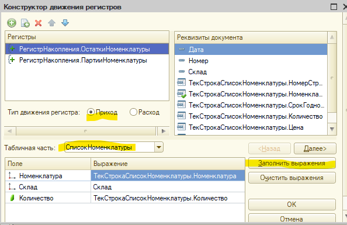
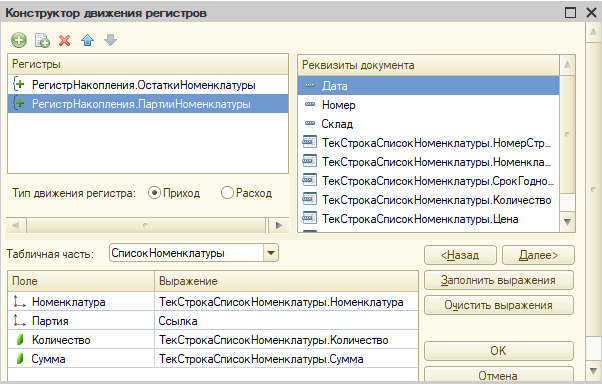
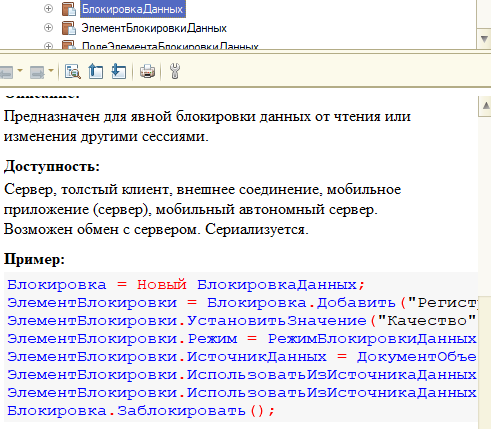
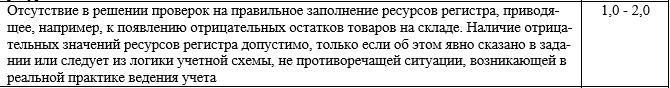
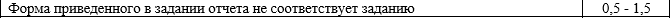
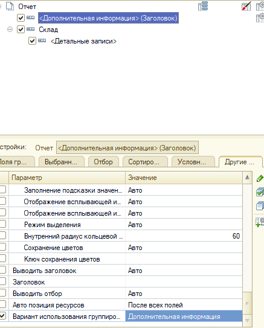
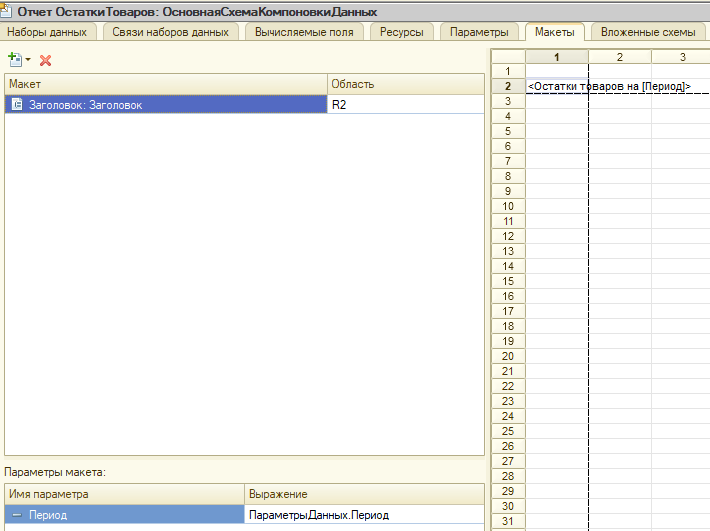
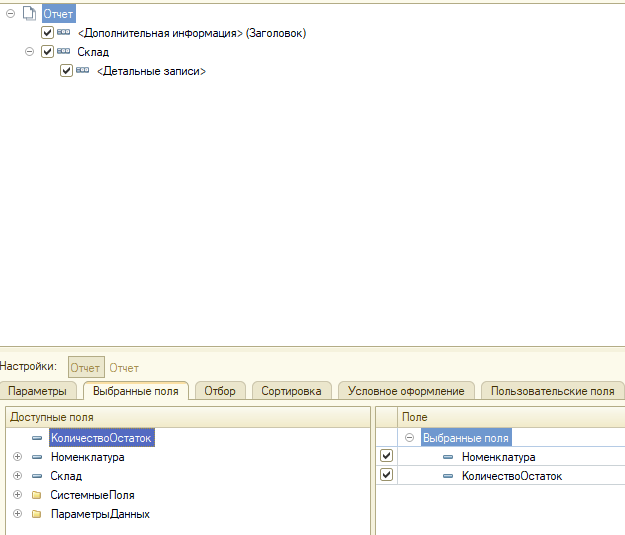
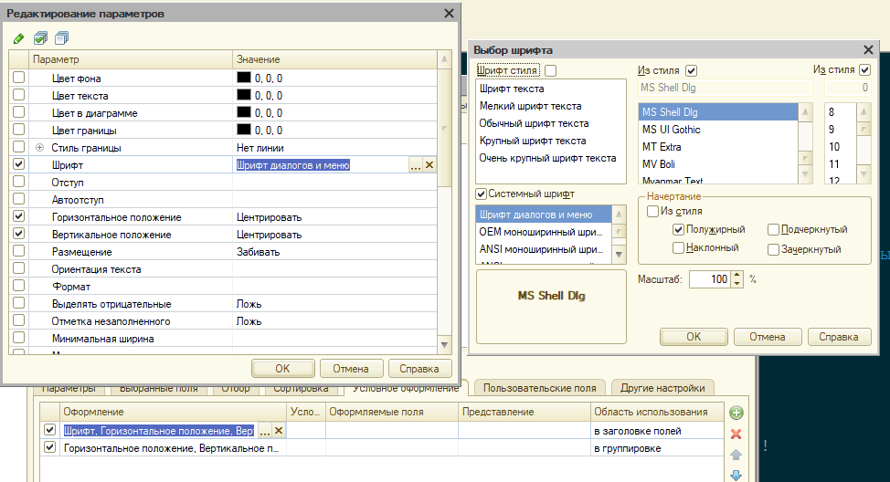
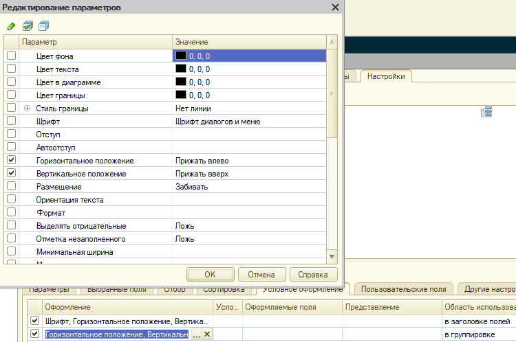

# Билет 1 - решение оперативной задачи

## Анализ билета

Выделяем ключевые особенности решения 1-2 словами, чтобы потом по этому чек-листу разрабатывать решение

* Используемые документы: "Приходная накладная", "Расходная накладная"
* Есть услуги в одной ТЧ
* Учет в разрезе складов / склад в шапке
* Требуется проверка остатков при списании
* Метод списания (Fifo, lifo) раз в год
* Себестоимость списывается без учёта склада
* Отчет простой, строится по одному регистру

Каждая особенность влияет на решение и настройку метаданных

**Проектирование регистра начинается с анализа отчета!** (см. билет 1 - бух. учет)

## Ход решения билета

### Подготовка объектов метаданных

* Добавляем реквизит "Вид номенклатуры" для справочника "Номенклатура"
  * Имя "ВидНоменклатуры"
  * Тип "ПеречислениеСсылка.ВидНоменклатуры"
    * Можно использовать БУЛЕВО
  * требуется для *"Есть услуги в одной ТЧ"*

* Создаём новый справочник "Склады"
  * Имя "Склады"
  * Создаём 2 предопределённых склада: "Основной" и "Транзитный"
  * требуется для *Учет в разрезе складов / склад в шапке*

* Дорабатываем учётные документы
  * Создаём реквизит шапки "Склад" в используемых документах
    * Тип: "СправочникСсылка.Склады"
    * Не забываем ставить признак *Проверка заполнения* в *Выдавать ошибку*
    * Для опер. учёт всё, но если почитать весь билет, то увидим, что в табличной части будет доп. разрез по срокам годности -его можно добавить сразу
    * Требуется для *Учет в разрезе складов / склад в шапке*

* Настраиваем регистр "ОстаткиНоменклатуры"
  * Измерение "Номенклатура"
    * Ставим признак "Запрет незаполненных значений"
  * Добавляем измерение "Склад"
    * Тип: "СправочникСсылка.Склады"
    * Ставим признак "Запрет незаполненных значений"
  * Регистраторы: "ПриходнаяНакладная", "РасходнаяНакладная"
  * Требуется для *Учет в разрезе складов / склад в шапке*

* Добавляем новый регистр "ПартииНоменклатуры"
  * Измерения "Номенклатура", "Партия", где
    * Номенклатура - СправочникСсылка.Номенклатура
    * Партия - ДокументСсылка.ПриходнаяНакладная
  * Регистраторы: "ПриходнаяНакладная", "РасходнаяНакладная"
  * Проверяем что включен режим разделения итогов (последняя вкладка)
  * Требуется для *Себестоимость списывается без учёта склада*

### Настройка документа "Приходная накладная"

* Для ускорения процесса первичные движения всегда накидываем через конструктор движений





* Результат:

```1C
    // регистр ОстаткиНоменклатуры Приход
    Движения.ОстаткиНоменклатуры.Записывать = Истина;
        СписокНоменклатуры Цикл
        Движение = Движения.ОстаткиНоменклатуры.Добавить();
        Движение.ВидДвижения = ВидДвиженияНакопления.Приход;
        Движение.Период = Дата;
        Движение.Номенклатура = ТекСтрокаСписокНоменклатуры.Номенклатура;
        Движение.Склад = Склад;
        Движение.Количество = ТекСтрокаСписокНоменклатуры.Количество;
    КонецЦикла;
    
    // регистр ПартииНоменклатуры Приход
    Движения.ПартииНоменклатуры.Записывать = Истина;
    Для Каждого ТекСтрокаСписокНоменклатуры Из СписокНоменклатуры Цикл
        Движение = Движения.ПартииНоменклатуры.Добавить();
        Движение.ВидДвижения = ВидДвиженияНакопления.Приход;
        Движение.Период = Дата;
        Движение.Номенклатура = ТекСтрокаСписокНоменклатуры.Номенклатура;
        Движение.Партия = Ссылка;
        Движение.Количество = ТекСтрокаСписокНоменклатуры.Количество;
        Движение.Сумма = ТекСтрокаСписокНоменклатуры.Сумма;
    КонецЦикла;
```

* Дорабатываем алгоритм, чтобы отфильтровать услуги

```1C  
    Движения.ОстаткиНоменклатуры.Записывать = Истина;
    Движения.ПартииНоменклатуры.Записывать = Истина;
    
    Запрос = Новый Запрос;
    Запрос.Текст = 
    "ВЫБРАТЬ
    |    ПриходнаяНакладнаяСписокНоменклатуры.Номенклатура КАК Номенклатура,
    |    СУММА(ПриходнаяНакладнаяСписокНоменклатуры.Количество) КАК Количество,
    |    СУММА(ПриходнаяНакладнаяСписокНоменклатуры.Сумма) КАК Сумма
    |ИЗ
    |    Документ.ПриходнаяНакладная.СписокНоменклатуры КАК ПриходнаяНакладнаяСписокНоменклатуры
    |ГДЕ
    |    ПриходнаяНакладнаяСписокНоменклатуры.Ссылка = &Ссылка
    |    И ПриходнаяНакладнаяСписокНоменклатуры.Номенклатура.ВидНоменклатуры = ЗНАЧЕНИЕ(Перечисление.ВидыНоменклатуры.Товар)
    |
    |СГРУППИРОВАТЬ ПО
    |    ПриходнаяНакладнаяСписокНоменклатуры.Номенклатура";
    
    Запрос.УстановитьПараметр("Ссылка", Ссылка);
    
    РезультатЗапроса = Запрос.Выполнить();
    
    Выборка = РезультатЗапроса.Выбрать();
    
    Пока Выборка.Следующий() Цикл
        
        Движение = Движения.ОстаткиНоменклатуры.Добавить();
        Движение.ВидДвижения = ВидДвиженияНакопления.Приход;
        Движение.Период = Дата;
        Движение.Номенклатура = Выборка.Номенклатура;
        Движение.Склад = Склад;
        Движение.Количество = Выборка.Количество;
        
        Движение = Движения.ПартииНоменклатуры.Добавить();
        Движение.ВидДвижения = ВидДвиженияНакопления.Приход;
        Движение.Период = Дата;
        Движение.Номенклатура = Выборка.Номенклатура;
        Движение.Партия = Ссылка;
        Движение.Количество = Выборка.Количество;
        Движение.Сумма = Выборка.Сумма;
        
    КонецЦикла;
```

### Настройка документа "Расходная накладная"

* Для ускорения процесса первичные движения всегда накидываем через конструктор движений
* Ключевые точки алгоритма
  * Получить учетную политику
    * Если метода нет - выдать ошибку и не проводить документ
    * требуется для *Метод списания (Fifo, lifo) раз в год*
  
  * Поставить признак записи и очистить прошлые записи регистра
    * это критически важно для корректного перепроведения документов
  
  * Определить методику проведения для каждого регистра
  
    * ПартииНоменклатуры - старая методика
      * ставим блокировку *БлокировкаДанных* по измерению "*Номенклатура*" с отбором по ТЧ
      * читаем партии на *МоментВремени*
      * проверяем, что кол-ва хватает, если нет ОТКАЗ = истина и вывод ошибок (не забываем про *Представление*)
      * Если хватает - заполняем движения
  
    * ОстаткиНоменклатуры - новая методика
      * заполняем движения
      * ставим флаг "БлокироватьДляИзменения"
      * записываем движения
      * читаем регистр на *Границу* документа с поиском отрицательных остатков
      * Если есть отрицательные остатки, ОТКАЗ = истина и вывод ошибок (не забываем про *Представление*)
  
  * Сделать движения по регистру "Партии номенклатуры" (старая методика)
    * Если нужно списывать партии - их ВСЕГДА надо сортировать по моменту времени, если явно не задан другой критерий
      * Fifo - по возрастанию
      * lifo - по убыванию
    * При списании не забываем решать проблему копеек
      * кратко: 3 шт. стоимостью 100 рублей =  33.33 за штуку // обратный расчет: 33.33 * 3 = 99.99 // вот это проблема копеек
      * Способ решения: при списании последней штучки списывать ВСЮ оставшуюся себестоимость (один из универсальных способов приведён в коде)
    * **Совет** Обратите внимание на переменную "КоличествоСписать": она важна
    * **Полезный приём!** по-умолчанию сортируйтесь по убыванию, а при необходимости просто убирайте слово "УБЫВ"
    * **полезный приём!** Кусок кода с блокировкой можно копировать из справки!
      * пишите слово *БлокировкаДанных* и ctrl+F1

      

  * Сделать движения по регистру "Остатки номенклатуры" (новая методика)
    * все пояснения по методике списания есть выше
    * по методике решения от 1С даже при отказе надо вывести ВСЕ ошибки, поэтому движения по 2м регистрам делаются независимо от того есть в одном ошибка или нет
    * в билете нет явного указания, что по второму билету нужно контролировать остатки, но указание на это есть в требования к экзамену, поэтому делаем
      

```1C
    УчетнаяПолитика = РегистрыСведений.УчетнаяПолитика.СрезПоследних(МоментВремени());
    Если УчетнаяПолитика.Количество() = 0 Тогда
        
        Отказ = Истина;
        
    Иначе
        
        МетодСписания = УчетнаяПолитика[0].МетодСписания;
        Если НЕ ЗначениеЗаполнено(МетодСписания) Тогда
            Отказ = Истина;
        КонецЕсли;
        
    КонецЕсли;
    
    Если Отказ Тогда
        
        Сообщение = Новый СообщениеПользователю;
        Сообщение.Текст = "Не задана учетная политика!";
        Сообщение.Сообщить();
        Возврат;
        
    КонецЕсли;
    
    Движения.ПартииНоменклатуры.Записывать = Истина;
    Движения.ОстаткиНоменклатуры.Записать();
    Движения.ПартииНоменклатуры.Записать();
    
    Блокировка = Новый БлокировкаДанных;
    ЭлементБлокировки = Блокировка.Добавить("РегистрНакопления.ПартииНоменклатуры");
    ЭлементБлокировки.Режим = РежимБлокировкиДанных.Исключительный;
    ЭлементБлокировки.ИсточникДанных = СписокНоменклатуры;
    ЭлементБлокировки.ИспользоватьИзИсточникаДанных("Номенклатура", "Номенклатура");
    Блокировка.Заблокировать();    
    
    // для контроля остатков используем регистр "Остатки" и новую методику
    Запрос = Новый Запрос;
    Запрос.МенеджерВременныхТаблиц = Новый МенеджерВременныхТаблиц;
    Запрос.Текст = 
    "ВЫБРАТЬ
    |    &Склад КАК Склад,
    |    РасходнаяНакладнаяСписокНоменклатуры.Номенклатура КАК Номенклатура,
    |    СУММА(РасходнаяНакладнаяСписокНоменклатуры.Количество) КАК Количество,
    |    СУММА(РасходнаяНакладнаяСписокНоменклатуры.Сумма) КАК Сумма
    |ПОМЕСТИТЬ ВТ_ДанныеДок
    |ИЗ
    |    Документ.РасходнаяНакладная.СписокНоменклатуры КАК РасходнаяНакладнаяСписокНоменклатуры
    |ГДЕ
    |    РасходнаяНакладнаяСписокНоменклатуры.Ссылка = &Ссылка
    |    И РасходнаяНакладнаяСписокНоменклатуры.Номенклатура.ВидНоменклатуры = &ВидНоменклатуры
    |
    |СГРУППИРОВАТЬ ПО
    |    РасходнаяНакладнаяСписокНоменклатуры.Номенклатура
    |
    |ИНДЕКСИРОВАТЬ ПО
    |    Номенклатура,
    |    Склад
    |;
    |
    |////////////////////////////////////////////////////////////////////////////////
    |ВЫБРАТЬ
    |    ВТ_ДанныеДок.Склад КАК Склад,
    |    ВТ_ДанныеДок.Номенклатура КАК Номенклатура,
    |    ВТ_ДанныеДок.Количество КАК Количество,
    |    ПартииНоменклатурыОстатки.Партия КАК Партия,
    |    ЕСТЬNULL(ПартииНоменклатурыОстатки.КоличествоОстаток, 0) КАК КоличествоПартии,
    |    ЕСТЬNULL(ПартииНоменклатурыОстатки.СуммаОстаток, 0) КАК СуммаПартии,
    |    ВТ_ДанныеДок.Номенклатура.Представление КАК НоменклатураПредставление
    |ИЗ
    |    ВТ_ДанныеДок КАК ВТ_ДанныеДок
    |        ЛЕВОЕ СОЕДИНЕНИЕ РегистрНакопления.ПартииНоменклатуры.Остатки(
    |                &МоментВремени,
    |                Номенклатура В
    |                    (ВЫБРАТЬ РАЗЛИЧНЫЕ
    |                        ВТ_ДанныеДок.Номенклатура КАК Номенклатура
    |                    ИЗ
    |                        ВТ_ДанныеДок КАК ВТ_ДанныеДок)) КАК ПартииНоменклатурыОстатки
    |        ПО ВТ_ДанныеДок.Номенклатура = ПартииНоменклатурыОстатки.Номенклатура
    |
    |УПОРЯДОЧИТЬ ПО
    |    ПартииНоменклатурыОстатки.Партия.МоментВремени УБЫВ
    |ИТОГИ
    |    МАКСИМУМ(Количество),
    |    СУММА(КоличествоПартии)
    |ПО
    |    Номенклатура";
    
    Запрос.УстановитьПараметр("ВидНоменклатуры", Перечисления.ВидыНоменклатуры.Товар);
    Запрос.УстановитьПараметр("МоментВремени", МоментВремени());
    Запрос.УстановитьПараметр("Ссылка", Ссылка);
    Запрос.УстановитьПараметр("Склад", Склад);
    
    Если МетодСписания = Перечисления.УчетнаяПолитика.ФИФО Тогда
        Запрос.Текст = СтрЗаменить(Запрос.Текст, ".МоментВремени УБЫВ", ".МоментВремени");
    КонецЕсли;
    
    РезультатЗапроса = Запрос.Выполнить();
    
    ВыборкаНоменклатура = РезультатЗапроса.Выбрать(ОбходРезультатаЗапроса.ПоГруппировкам);
    
    Пока ВыборкаНоменклатура.Следующий() Цикл
        
        Движение = Движения.ОстаткиНоменклатуры.Добавить();
        Движение.ВидДвижения = ВидДвиженияНакопления.Расход;
        Движение.Период = Дата;
        Движение.Номенклатура = ВыборкаНоменклатура.Номенклатура;
        Движение.Склад = Склад;
        Движение.Количество = ВыборкаНоменклатура.Количество;
        
        НеХватает = ВыборкаНоменклатура.Количество - ВыборкаНоменклатура.КоличествоПартии;
        Если НеХватает > 0 Тогда
            Отказ = Истина;
            Сообщение = Новый СообщениеПользователю;
            Сообщение.Текст = "Не хватает товара: " + ВыборкаНоменклатура.НоменклатураПредставление + " по партиям в количестве: " + НеХватает;
            Сообщение.Сообщить();
        КонецЕсли;
        
        Если Отказ Тогда 
            Продолжить;
        КонецЕсли;
        
        ВыборкаДетальныеЗаписи = ВыборкаНоменклатура.Выбрать();
        
        КоличествоСписать = ВыборкаНоменклатура.Количество;
        
        Пока КоличествоСписать > 0 И ВыборкаДетальныеЗаписи.Следующий() Цикл
            
            КолПоПартии = МИН(КоличествоСписать, ВыборкаДетальныеЗаписи.КоличествоПартии);
            Себестоимость = ?(КолПоПартии = ВыборкаДетальныеЗаписи.КоличествоПартии, 
              ВыборкаДетальныеЗаписи.СуммаПартии, 
              КолПоПартии * ВыборкаДетальныеЗаписи.СуммаПартии / ВыборкаДетальныеЗаписи.КоличествоПартии);
            
            Движение = Движения.ПартииНоменклатуры.Добавить();
            Движение.ВидДвижения = ВидДвиженияНакопления.Расход;
            Движение.Период = Дата;
            Движение.Номенклатура = ВыборкаДетальныеЗаписи.Номенклатура;
            Движение.Партия = ВыборкаДетальныеЗаписи.Партия;
            Движение.Количество = КолПоПартии;
            Движение.Сумма = Себестоимость;
            
            КоличествоСписать = КоличествоСписать - КолПоПартии;
            
        КонецЦикла;
        
    КонецЦикла;
    
    Движения.ОстаткиНоменклатуры.БлокироватьДляИзменения = Истина;
    Движения.ОстаткиНоменклатуры.Записать();
    
    Запрос.Текст = 
    "ВЫБРАТЬ
    |    ОстаткиНоменклатурыОстатки.Номенклатура КАК Номенклатура,
    |    ОстаткиНоменклатурыОстатки.Склад КАК Склад,
    |    -ОстаткиНоменклатурыОстатки.КоличествоОстаток КАК КоличествоОстаток,
    |    ОстаткиНоменклатурыОстатки.Номенклатура.Представление КАК НоменклатураПредставление,
    |    ОстаткиНоменклатурыОстатки.Склад.Представление КАК СкладПредставление
    |ИЗ
    |    РегистрНакопления.ОстаткиНоменклатуры.Остатки(
    |            &Граница,
    |            (Номенклатура, Склад) В
    |                (ВЫБРАТЬ РАЗЛИЧНЫЕ
    |                    ВТ_ДанныеДок.Номенклатура КАК Номенклатура,
    |                    ВТ_ДанныеДок.Склад КАК Склад
    |                ИЗ
    |                    ВТ_ДанныеДок КАК ВТ_ДанныеДок)) КАК ОстаткиНоменклатурыОстатки
    |ГДЕ
    |    ОстаткиНоменклатурыОстатки.КоличествоОстаток < 0";
    Запрос.УстановитьПараметр("Граница", Новый Граница(МоментВремени(),ВидГраницы.Включая));
    
    Рез = Запрос.Выполнить();
    Выборка = Рез.Выбрать();
    Пока Выборка.Следующий() Цикл
        
        Отказ = Истина;
        
        Сообщение = Новый СообщениеПользователю;
        Сообщение.Текст = "Не хватает товара: " + Выборка.НоменклатураПредставление + " по складу: " + Выборка.СкладПредставление + " в количестве: " + Выборка.КоличествоОстаток;
        Сообщение.Сообщить();
        
    КонецЦикла;

```

### Подготовка отчета

* Отчет всегда делается на СКД, кроме специфических вроде диаграммы Ганта
* Проектирование учётной схема всегда делается с учётом запроса
  * запрос для отчета в идеале должен быть очень и очень просто ибо на него меньше всего времени остаётся на экзамене
* Если это не требуется для формирования отчета - никаких отборов в запрос добавлять не надо
* Отчет должен **В ТОЧНОСТИ!** соответствовать ТЗ, включая проблемы, форматы даты, выравнивание данных в таблице и т.д.

  

* Все нюансы настройки отчета привести невозможно, поэтому только ключевые моменты
  * Вот запрос данного очтета:

```1C
ВЫБРАТЬ
    ОстаткиНоменклатурыОстатки.Номенклатура КАК Номенклатура,
    ОстаткиНоменклатурыОстатки.Склад КАК Склад,
    ОстаткиНоменклатурыОстатки.КоличествоОстаток КАК КоличествоОстаток
ИЗ
    РегистрНакопления.ОстаткиНоменклатуры.Остатки КАК ОстаткиНоменклатурыОстатки
```

* Как настроить заголовок
  * Сделать новую область в отчете с настройками, как на скриншоте

 

* Сделать макет

  

* скриншоты других настроек






