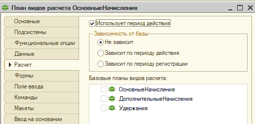
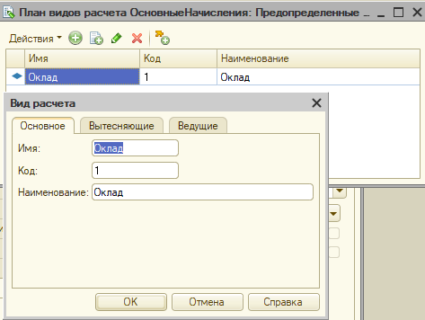
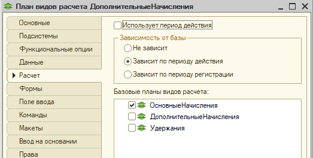
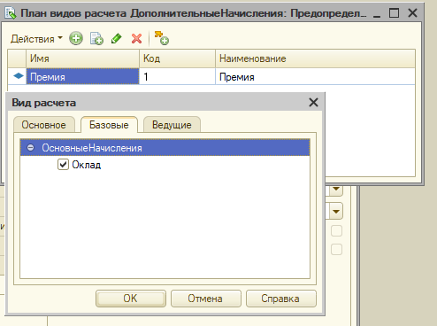
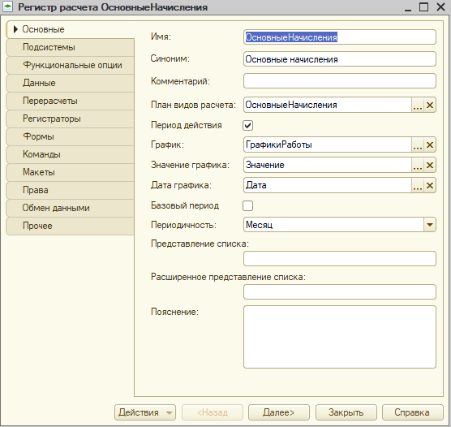
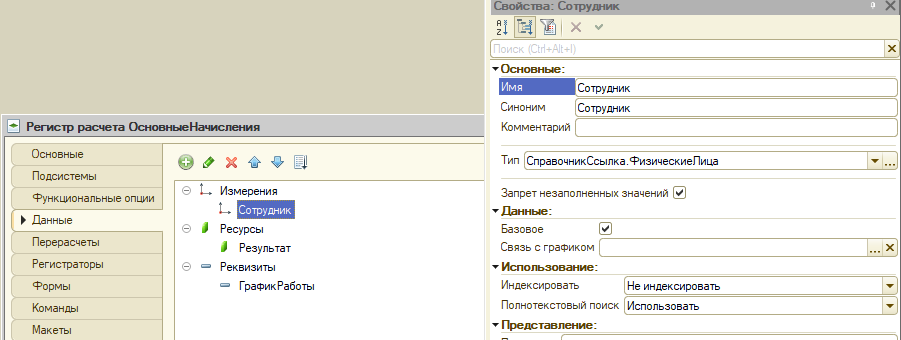
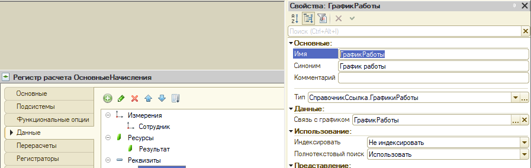
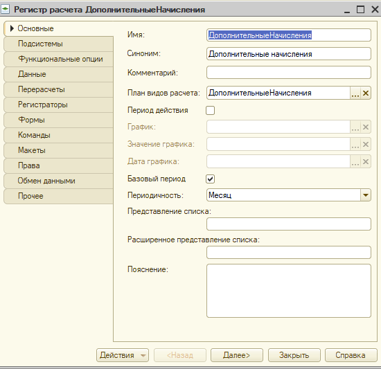
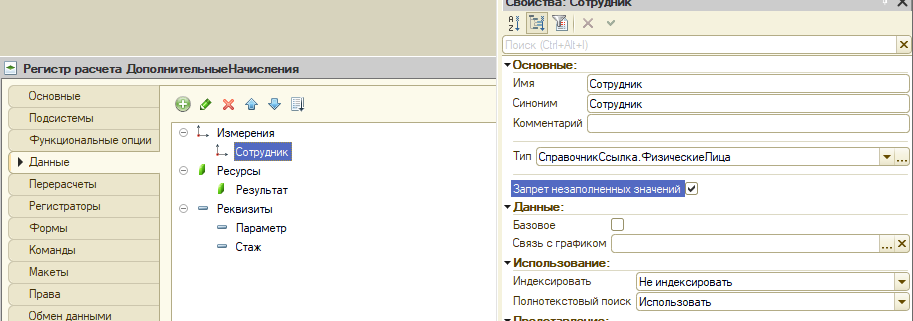

# Билет 1 - решение задачи по расчетам

**Дисклеймер** Данные записи, по-сути, практическая выжимка решения, теор. часть практически не разбирается! Поэтому важен теоретических базис от любого доступного источника: Курс 1С УЦ, Курс Гилёва, Курс Чистова, практическое пособие разработчика и т.д.

## Краткая справка

см. файл [Теория решения расчетных задач.md](https://github.com/zeltyr/1c_platforma_spec/blob/master/HowTo/%D0%A2%D0%B5%D0%BE%D1%80%D0%B8%D1%8F%20%D1%80%D0%B5%D1%88%D0%B5%D0%BD%D0%B8%D1%8F%20%D1%80%D0%B0%D1%81%D1%87%D0%B5%D1%82%D0%BD%D1%8B%D1%85%20%D0%B7%D0%B0%D0%B4%D0%B0%D1%87.md)

## Анализ билета

Выделяем ключевые особенности решения 1-2 словами, чтобы потом по этому чек-листу разрабатывать решение

* Используемые документы: "Начисление зарплаты"
* Используется метод отклонений
* *Подразделение* - можно не обрабатывать (нет совместительства и нет в отчете)
* В регистре *Данные графика* нужна доп. аналитика *Графики работы*
* Первый вид расчета: ОКЛАД = [ЧасыФакт] * [ДневнаяСтавка]
  * *ЧасыФакт* - данные графика (*Период действия (факт)*)
  * *ДневнаяСтавка* = [НачальноеЗначениеОклада] / [ЧасыПлан]
    * *НачальноеЗначениеОклада* - данные регистра сведений на начало месяца
    * *ЧасыПлан* - данные графика (*Период действия (план)*)
* Второй вид расчета: ПРЕМИЯ = [Процент] * [ОКЛАД]
  * *Процент* - определяется по шкале значений
    * Шкала значений зависит от стажа и необходима будет дату устройства на работу, чтобы вычислить стаж
  * *ОКЛАД* - начисленный **в том же месяце** ОКЛАД (*базовый период* = этот месяц)
* Перерасчетов нет (это отлично)
* На форме необходима кнопка "Рассчитать"
* Переход из периода в период недопустим (это отлично, работы меньше)
* Отчет только за один месяц и он достаточно простой

**Проектирование решения в части расчетов достаточно простое и имеет чёткую последовательность!**

Общий алгоритм:

1. Выяснить сколько вообще начислений удержаний у нас есть и как они вычисляются

2. Настройка зависимостей между получившимися видами расчета и включить, если требуется, зависимость по периоду действия

    | Вид расчета | Вытесняющий | Базовый | Ведущий  | Учет по периоду действия |
    | :---------- | :---------: | :-----: | :------: | -----------------------: |

3. Определить порядок расчета

* Анализ нашей задачи:

    | Вид расчета | Вытесняющий | Базовый | Ведущий  | Учет по периоду действия |
    | :---------- | :---------: | :-----: | :------: | -----------------------: |
    | **Оклад**   | -           | -       | Х        | +                        |
    | Премия      |             | ОКЛАД   | Х        | -                        |

* У нас 2 вида расчета: Оклад и Премия

* Вписываем оклад
  * Оклад зависит от факта отработанного времени, значит есть учет по периоду действия
  * У нас нет больничных, прогулов и т.д., а значит нет вытеснений
  * Оклад не зависит от других видов расчета, поэтому базовых нет
  * Ведущий - используются только если есть перерасчёты, у нас их нет

* Вписываем премию
  * Премия не зависит от периода действия, хотя и используется часы план, т.к. неважно сколько отработал сотрудник!
  * Раз нет периода действия - значит нет вытеснений
  * Так как считается на основании оклада - значит у него есть база - *ОКЛАД*  
  * Ведущий - используются только если есть перерасчёты, у нас их нет

* Определяем порядок расчета
  * Премия зависит от оклада, поэтому считается строго ПОСЛЕ расчета оклада!

* У нас 1 вид расчета имеет период действия, а второй - нет: нам нужно будет использовать 2 плана видов расчета

* Этот анализ - самое главное, что надо сделать при проектировании решения, дальше, собственно, начинаем решать!

## Проектирование метаданных

---

* Общие сведения
  
  * Графики настраиваем поскольку у нас *метод отклонений* и чтобы он корректно работал эти метаданных нужны
  * Шкала премии нужна для расчета премии - см. выявленную формулу
  * Сведения о сотрудниках нужны для хранения оклада, т.к. *первоначальное значение оклада может изменяться не чаще, чем один раз в день, но берется на начало расчетного периода*

* Создание справочника *Графики работы*
  * можно сразу создать 1 график "Пятидневка"

* Настройка регистра сведений *Графики работы*
  * Добавляем измерение "График работы" (тип: *СправочникСсылка.ГрафикиРаботы*)

* Создание регистра сведений *Шкала премии*
  * Создаём 2 измерения: *От*, *До*
    * Тип у всех 1: Число(5,2)
  * Создаём ресурс: *Значение* (тип: Число(5,2))

* Настройка регистра сведений *Сведения о сотрудниках*
  * Задаём периодичность 1 раз в день
  * удаляем измерение *Подразделение* - т.к. решили его не обрабатывать

* Настройка плана вида расчета *Основные Начисления*
  * Вкладка *Расчет*
    * Включаем *Использует период действия*

  
  
  * Настройка предопределённых
    * В основном плане видов расчета у нас должен быть 1 элемент - *Оклад*
    * никаких настроек у него делать не надо

 

* Настройка плана вида расчета *Дополнительные Начисления*
  
  * Вкладка *Расчет*
    * Настройка *Использует период действия* должна быть выключена
    * Включаем зависимость от базы и выбираем ПВР *Основные начисления*
      * Требуется для расчета премии по базовому периоду оклада

  
  
  * Настройка предопределённых
    * В дополнительном плане видов расчета у нас должен быть 1 элемент - *Премия*
    * Необходимо включить зависимость по базе от *Оклад* и всё

 

* Создание регистра расчета *Основные начисления*
  
  * Вкладка *Основные*
    * Привязываем к регистру ПВР *Основные начисления*
    * Включаем учёт по периоду действия и выставляем настройки *(ВСЕГДА ТАКИЕ)*
      * Регистр где хранится рабочий календарь: всегда **Графики работы**
      * Значение графика: всегда **Значение**
      * Дата графика: всегда **Дата**
    * Базы нет, поэтому базовый период не включаем

    
  
  * Вкладка "Данные"

    * Добавляем ресурс *Результат* (тип: Число(12,2))
      * стандартный, будет при любом варианте решения

    * Добавляем измерение *Сотрудник* (тип: *СправочникСсылка.ФизическиеЛица*)
      * Включаем *Запрет незаполненных значений*
      * Так как данный регистр является БАЗОЙ для другого регистра, у его измерений можно и нужно включить флаг *Базовый*

    

    * Добавляем реквизит *График работы* (тип: *СправочникСсылка.ГрафикиРаботы*)
      * **ВАЖНО** ВСЕ ИЗМЕРЕНИЯ РЕГИСТРА СВЕДЕНИЙ *График работы* ДОЛЖНЫ БЫТЬ СВЯЗАНЫ С ИЗМЕРЕНИЕМ/РЕКВИЗИТОМ РЕГИСТРА РАСЧЕТА
        * иначе вычисления методом отклонений корректно работать НЕ будут!
      * Устанавливаем связь с измерением *График работы* регистра сведений *Графики работы*

    

* Создание регистра расчета *Дополнительные начисления*

  * Добавляем ресурс *Результат* (тип: Число(12,2))
    * стандартный, будет при любом варианте решения

  * Вкладка *Основные*
    * Привязываем к регистру ПВР *Дополнительные начисления*
    * НЕ включаем учёт по периоду действия, т.к. у нас никакой зависимости нет
    * Зато есть зависимость от базы, поэтому ставим признак *базовый период*
      * на экзамене он всегда *Месяц*

    

  * Вкладка "Данные"
  
    * Добавляем измерение *Сотрудник* (тип: *СправочникСсылка.ФизическиеЛица*)
      * Включаем *Запрет незаполненных значений*
      * Флаг *Базовый* ставить НЕ надо, т.к. этот регистр НЕ является базой для других

    * Добавляем реквизиты, которые нужны для формирования отчета *Параметр*, *Стаж*  (тип: *Число(12,2)*)
      * **Совет** все переменные расчета можно выкинуть в реквизиты для контроля: н-р: сохранять туда значение *ЧасыФакт* и т.д. чтобы было легче отлаживать решение
        * наличие доп. реквизитов в данном случае НЕ считает ошибкой

    

* Настройка документа *Начисление зарплаты*

## Разработка

### Доработка обработки *Заполнение графика*

### Доработка проведения документа *Начисление зарплаты*
