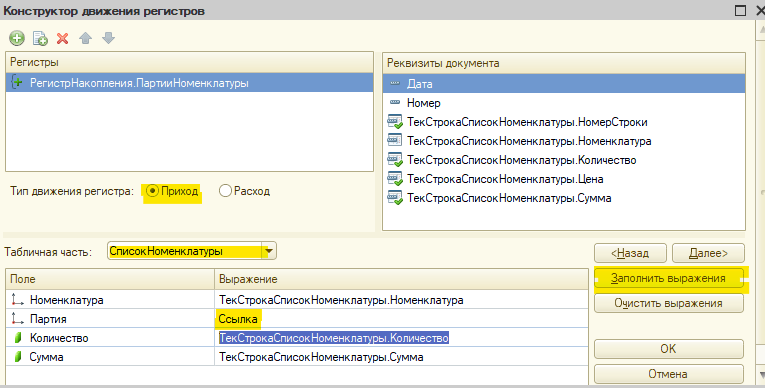

# Билет 2 - решение задачи по опер. учёту

**Дисклеймер** Данные записи, по-сути, практическая выжимка решения, теор. часть практически не разбирается! Поэтому важен теоретических базис от любого доступного источника: Курс 1С УЦ, Курс Гилёва, Курс Чистова, практическое пособие разработчика и т.д.

## Анализ билета

Выделяем ключевые особенности решения 1-2 словами, чтобы потом по этому чек-листу разрабатывать решение

* Используемые документы: "Приходная накладная", "Расходная накладная"
* Есть услуги в одной ТЧ
* Партия указывается в документе вручную
* Требуется проверка остатков при списании
* Отчет сложный, требует доп. анализа

Каждая особенность влияет на решение и настройку метаданных

**Проектирование регистра начинается с анализа отчета!**

* В отчете 1 аналитика: *Номенклатура*

* В отчете 3 получаемых показателя и 3 расчетных
  
  * сколько у нас расчетных - прямо сказано в ТЗ
  * Расчетные показатели:
    * *Прибыль* - *Сумма продаж* - *Себестоимость*
    * *Интервал* - *Дата первой отгрузки* - *Дата последней отгрузки* / *Количество отгрузок*
    * *Срок* - *Конец периода отчета* - *Дата последней отгрузки*

* Дальше тезисно формулируем нюансы задачи
  
  * Отчет строится за период, т.е. это обороты по номенклатуре

  * В отчете должна быть *Сумма продаж*

  * Для контроля остатков нам нужен регистр *Остатки* с разрезами *Номенклатура* и *Партия* и показателями *Количество* и *Себестоимость*

  * *Себестоимость* <> *Сумма продаж* - это разные показатели

  * В регистр остатков сумму продаж добавлять нельзя, ведь тогда её придётся выводить в ноль, а это абсурд

  * Итого, нужен 1 остаточный регистр (для контроля остатков) и 1 оборотный (для отчета)
    * **ВАЖНО** Все ресурсы, нужны для отчета заводим в оборотный регистр, иначе будет сложный запрос и попадёте на ошибку "неоптимальное решение"

## Ход решения билета

### Настраиваем объекты метаданных

* Добавляем реквизит *"Вид номенклатуры"* для справочника *"Номенклатура"*
  * Имя *"ВидНоменклатуры"* (тип: *"ПеречислениеСсылка.ВидНоменклатуры"* или *булево*)
  * требуется для *"Есть услуги в одной ТЧ"*

* Дорабатываем документ *Расходная накладная*
  * Добавляем в ТЧ реквизит: *Партия* (тип: *ДокументСсылка.ПриходнаяНакладная*)
    * Так как в ТЗ ничего не сказано, НЕ НАДО делать отборы вида: видеть документы по выбранной номенклатуре и т.д. и т.п.
    * Не забываем ставить признак *Проверка заполнения* в *Выдавать ошибку*
  * требуется для *"Партия указывается в документе вручную"*

* Настраиваем регистр *"ОстаткиНоменклатуры"*
  
  * Измерения:
    * Измерение *"Номенклатура"*
      * Ставим признак *"Запрет незаполненных значений"*
    * Добавляем измерение *Партия* (тип: *ДокументСсылка.ПриходнаяНакладная*)
      * Ставим признак *"Запрет незаполненных значений"*
 
  * Ресурсы:
    * Количество (тип: *Число(10,0)*)
    * Себестоимость (тип: *Число(12,2)*)
  
  * Регистраторы:
    * *"ПриходнаяНакладная"*, *"РасходнаяНакладная"*
  
  * Включаем режим разделения итогов (последняя вкладка)
  * Требуется для *Требуется проверка остатков при списании*

* Добавляем новый регистр *"Продажи"*
 
  * Измерения:
    * *Номенклатура* (тип: *СправочникСсылка.Номенклатура*)
 
  * Ресурсы:
    * Количество (тип: *Число(10,0)*)
    * Себестоимость (тип: *Число(12,2)*)
    * СуммаПродажи (тип: *Число(12,2)*)

  * Регистраторы:
    * *"РасходнаяНакладная"*

  * Проверяем что включен режим разделения итогов (последняя вкладка)
  * Требуется для *Отчет сложный...*

### Настройка документа "Приходная накладная"

* Для ускорения процесса первичные движения всегда накидываем через конструктор движений
  * Обратите внимание, у меня регистр переименован - так делать НЕ НАДО! или создайте свой или не меняйте имя (я тогда забыл, что не надо трогать объекты метаданных самой каркасной)
  * Обратите внимание, тут испробован метод формирования движений БЕЗ конструктора - запросом (см. код и пояснения к нему) 



* Результат

```1C

    // регистр ПартииНоменклатуры Приход
    Движения.ПартииНоменклатуры.Записывать = Истина;
    Для Каждого ТекСтрокаСписокНоменклатуры Из СписокНоменклатуры Цикл
        Движение = Движения.ПартииНоменклатуры.Добавить();
        Движение.ВидДвижения = ВидДвиженияНакопления.Приход;
        Движение.Период = Дата;
        Движение.Номенклатура = ТекСтрокаСписокНоменклатуры.Номенклатура;
        Движение.Партия = Ссылка;
        Движение.Количество = ТекСтрокаСписокНоменклатуры.Количество;
        Движение.Сумма = ТекСтрокаСписокНоменклатуры.Сумма;
    КонецЦикла;

```

* Дорабатываем алгоритм, чтобы отфильтровать услуги
  * тут я, кстати, попробовал подход БЕЗ КОНСТРУКТОРА - через формирование движений в запросе и загрузку результата
    * по времени выходит плюс минус тоже самое, если знаете, что делать и как делать это быстро

```1C 
    Запрос = Новый Запрос;
    Запрос.Текст = 
        "ВЫБРАТЬ
        |    ПриходнаяНакладнаяСписокНоменклатуры.Ссылка.Дата КАК Период,
        |    ПриходнаяНакладнаяСписокНоменклатуры.Номенклатура КАК Номенклатура,
        |    ПриходнаяНакладнаяСписокНоменклатуры.Ссылка КАК Партия,
        |    СУММА(ПриходнаяНакладнаяСписокНоменклатуры.Количество) КАК Количество,
        |    СУММА(ПриходнаяНакладнаяСписокНоменклатуры.Сумма) КАК Сумма,
        |    ЗНАЧЕНИЕ(ВидДвиженияНакопления.Приход) КАК ВидДвижения
        |ИЗ
        |    Документ.ПриходнаяНакладная.СписокНоменклатуры КАК ПриходнаяНакладнаяСписокНоменклатуры
        |ГДЕ
        |    ПриходнаяНакладнаяСписокНоменклатуры.Ссылка = &Ссылка
        |    И ПриходнаяНакладнаяСписокНоменклатуры.Номенклатура.ВидНоменклатуры = &ВидНоменклатуры
        |
        |СГРУППИРОВАТЬ ПО
        |    ПриходнаяНакладнаяСписокНоменклатуры.Ссылка.Дата,
        |    ПриходнаяНакладнаяСписокНоменклатуры.Ссылка,
        |    ПриходнаяНакладнаяСписокНоменклатуры.Номенклатура";
    
    Запрос.УстановитьПараметр("ВидНоменклатуры", Перечисления.ВидыНоменклатуры.Товар);
    Запрос.УстановитьПараметр("Ссылка", Ссылка);
    
    РезультатЗапроса = Запрос.Выполнить();
    Если НЕ РезультатЗапроса.Пустой() Тогда
        Движения.ПартииНоменклатуры.Записывать = Истина;
        Движения.ПартииНоменклатуры.Загрузить(РезультатЗапроса.Выгрузить());
    КонецЕсли;

```
